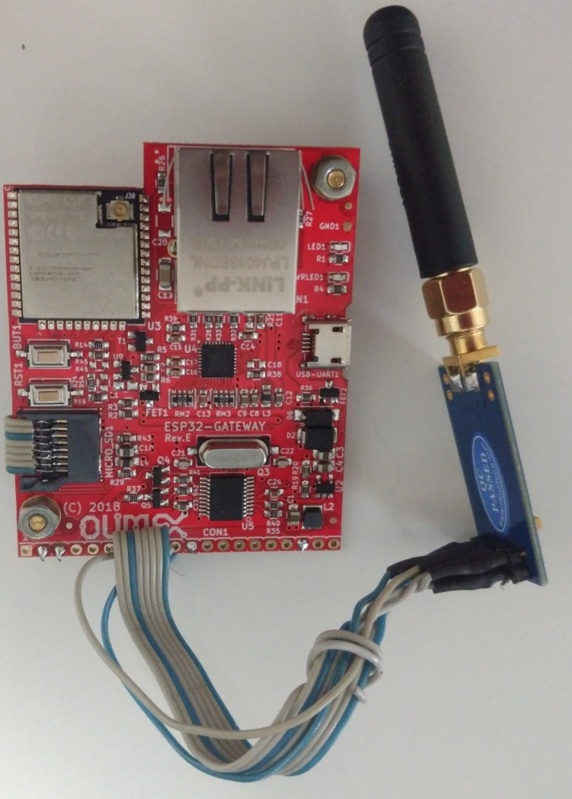
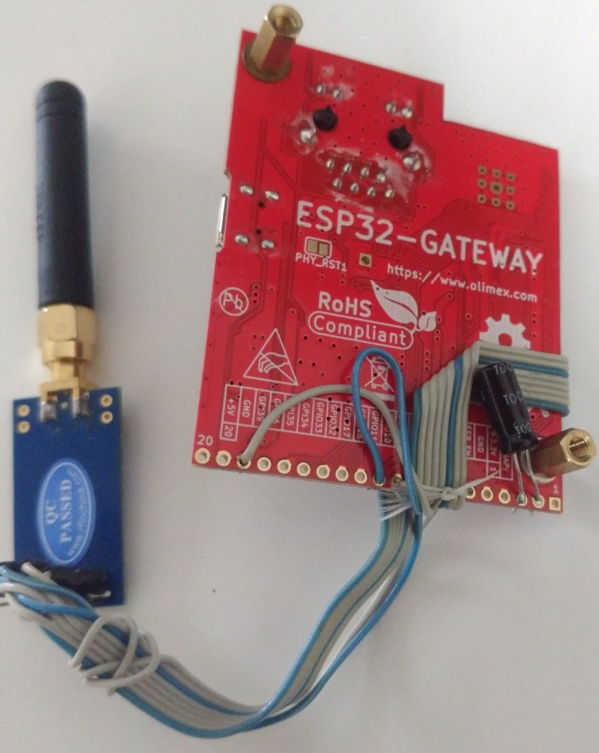
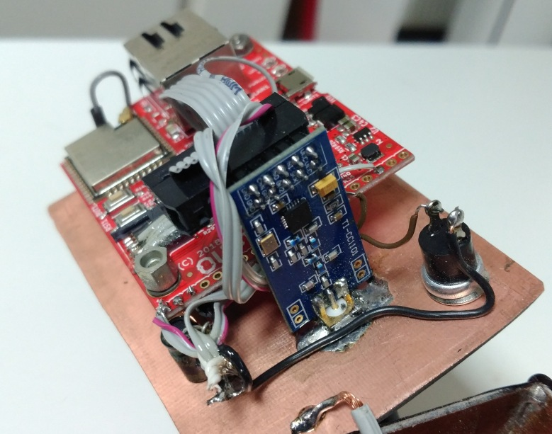
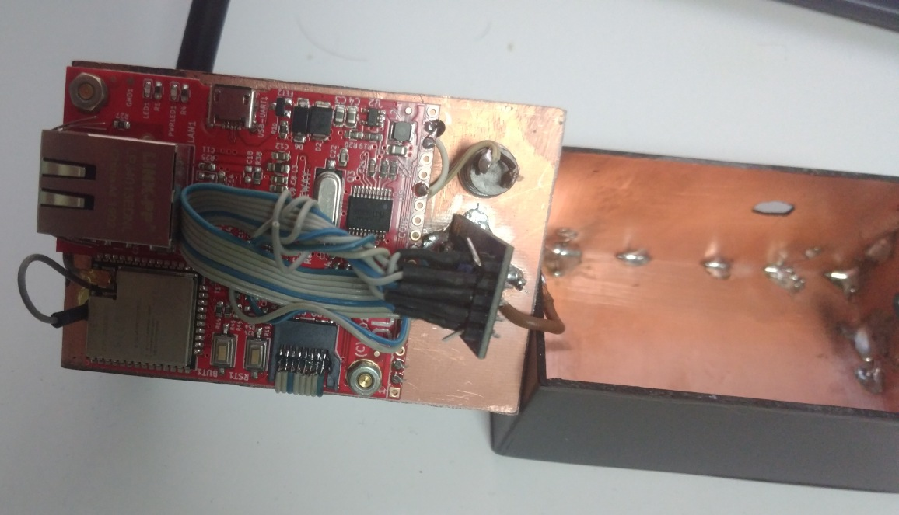
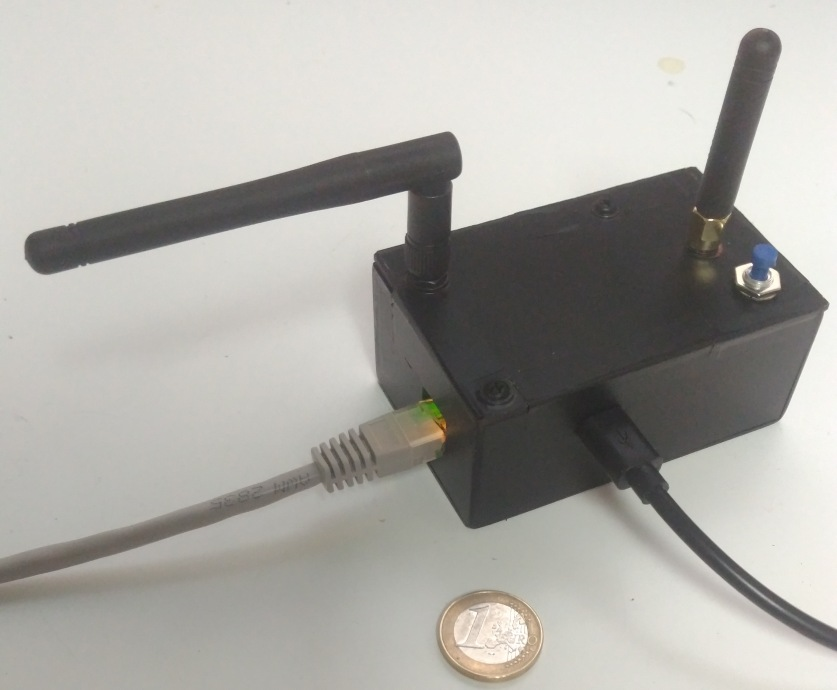

##  Baunanleitung: Tronferno mit Olimex-ESP32-Gateway + Neuftech CC1101


#### 1. Das ESP32 Mikrocontroller Board

##### Die ESP32-Gateway Revisionen

Revisionen bis "E" haben nicht ausreichend GPIOs auf dem Erweiterungsanschluss liegen. Man kann diese aber trotzdem verwenden, wenn man ein Flachbandkabel an die Kontakte der SD-Kartenfassung lötet, was aber gute Lötkenntnisse erfordert.  Ab Revision "F" sind diese Kontakte auch auf dem Erweiterungsanschluss vorhanden.  Ich verwende die Revision "E".

##### Die GPIO12 Problematik

Der CC1101 wird über ein serielles Interface gesteuert. Obwohl der ESP32 im Prinzip erlaubt beliebige GPIOs dafür zu benutzen, ist es prinzipiell effizienter und schneller die dafür vorgesehenen GPIOs zu verwenden. Für die Schnittstelle SPI2 sind das die GPIOs 12, 13, 14 und 15.

GPIO-12 ist ein sogenannter Strapping-Pin welcher beim Booten abgefragt wird.  Durch das Verbinden mit dem CC1101-SPI-Pins schaltet der ESP32 beim Booten die Spannung des Flash-ROMs auf 1.8V. Bei ESP32 Modulen mit Flash-ROM-Spannungen von 3.3V wird dadurch dann das Booten fehlschlagen.  Die Lösung ist, entweder den GPIO-12 nicht zu verwenden oder die Flash-ROM-Spannung fest auf 3.3V einzustellen mittels des efuse Programms. Diese Einstellung ist endgültig und man sollte sicher sein, dass der Flash-ROM auch wirklich vom Typ 3.3V ist.

```
    esp-idf/components/esptool_py/esptool/espefuse.py set_flash_voltage 3.3V
```
 
Da das SPI Interface des CC1101 sowieso nur relativ langsam getaktet wird, kann man aber genausogut den GPIO-12 nicht verwenden. SPI2 wird dann intern umständlicher angesteuert und kann dadurch dann die sonst möglichen maximalen 80MHz Taktfrequenz nicht erreichen.


##### Ethernet-Einstellungen

Das Gateway verwendet den PHY Chip 8710A und schaltet die Stromversorgung für diesen über GPIO-5.
 
Im Webinterface ist folgende Konfiguration einzustellen:
  * PHY Chip: 8720
  * PHY Power-GPIO: 5
 
##### Die ESP_EN Problematik

Um das Board immer problemlos über USB flashen zu können, sollte ein Elektrolytkondensator (ca. 10 uF) am ESP32-Gateway-Erweiterunsport zwischen Anschluss 2 (ESP_EN) und Anschluss 3 (GND) gelötet werden. Der Minuspol des Kondensators an GND. 


#### 2. Das CC1101 Funkmodul

Es sollte jedes Modul funktionieren welches für 433 MHz gedacht ist. 866 MHz Module sind ungeignet.
Ich verwende hier ein CC1101 Modul der "Marke" Neuftech für ca 7 EUR bei Amazon, was aber etwas abweicht bei der Frequenz.
Ähnlich aussehende Boards neuerer Version (V2.0) von Aliexpress scheinen genauer, wobei ich  der Praxis hier beide gleich gut funktionieren.
 

In der Weboberfläche kann jedem der sechs benötigten CC1101 Anschlüsse ein beliebiger GPIO zugewiesen werden.

##### Versorgungsspannung

Die Masse und Versorgungsspannung (3.3V) wird vom ESP32-Gateway-Erweiterungsport gehohlt:
  * CC1101 VCC <=> Gateway-Port-Pin-1 (3.3V)
  * CC1101 GND <=> Gateway-Port-Pin-2 (GND)
  
Bei Revision "E" kann diese auch zusammen mit den SPI-GPIOs mit vom SD-Kartenslot entnommen werden. Die 3.3V von dort sind bereits entkoppelt mit Drossel und Kondensator.

#### 3. Der Taster

Der Taster dient zum Einstellen der Endpunkte eines Rollladenmotors.
Es ist ein Schließer-Taster ("NO") zwischen Masse und einem beliebigen GPI-Pin.  Der GPI-Pin wird in der Weboberfläche konfiguriert.


#### 4. Zusammenfassung der von mir benutzen GPIOs und Anschlüsse

Für Gateway bis Revision E:
   1. CC1101-SO: GW-SD-Card-Pin-1 (GPIO12)
   1. CC1101-SI: GW-SD-Card-Pin-2 (GPIO13)
   1. CC1101-SCK: GW-SD-Card-Pin-5 (GPIO14)
   1. CC1101-CSN: GW-SD-Card-Pin-3 (GPIO15)
   1. CC1101-VCC: GW-SD-Card-Pin-4  oder GW-Pin-1 (3.3V)
   1. CC1101-GND: GW-SD-Card-Pin-6  oder GW-Pin-2 (GND)
   1. CC1101-GO0: GW-Pin-10 (GPIO16)
   1. CC1101-GO2: GW-Pin-18 (GPI39)
   1. Taster: GW-Pin-15 (GPI34) und GW-Pin-2 (GND)
   1. 10uF Elektrolytkondensator: (-) an GW-Pin-2 (GND) und (+) an GW-Pin-3 (ESP_EN)

Für Gateway ab Revision F:
   1. CC1101-SO: GW-Pin-7 (GPIO12)
   1. CC1101-SI: GW-Pin-8 (GPIO13)
   1. CC1101-SCK: GW-Pin-9 (GPIO14)
   1. CC1101-CSN: GW-Pin-10 (GPIO15)
   1. CC1101-VCC: GW-Pin-1 (3.3V)
   1. CC1101-GND: GW-Pin-2 (GND)
   1. CC1101-GO0: GW-Pin-10 (GPIO16)
   1. CC1101-GO2: GW-Pin-18 (GPI39)
   1. Taster: GW-Pin-15 (GPI34) und GW-Pin-2 (GND)
   1. 10uF Elektrolytkondensator: (-) an GW-Pin-2 (GND) und (+) an GW-Pin-3 (ESP_EN)
   
   
#### 5. Debugging für Entwickler

Zum Debuggen des ESP32-Boards benötigt man die GPIOs 12,13,14,15. Es bietet sich an diese am CC1101 mittels IDC-Buchse lösbar zu verbinden. Zum Debuggen kann man dann den Stecker abziehen und die FT2232 debug probe anschlußdrähte dort in die IDC-Buchse einstecken. In der Weboberfläche sollte dazu der CC1101 deaktiviert werden.


#### 6. Bilder










