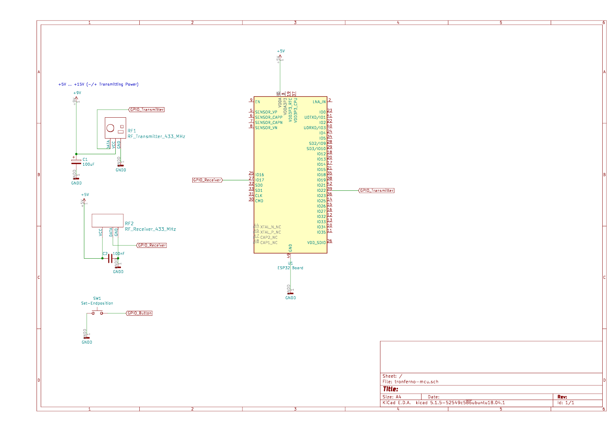

#### Mikrocontroller-Board

  * Empfohlen: Board mit ESP32-WROOM, 4MB FLASH, WLAN, Optional: Ethernet mit PHY8710/8720 Chip.
  * LAN/Ethernet wird von verschiedenen Board (und Boardrevisionen) verschieden implementiert
  * LAN/Ethernet wurde getestet mit dem folgenden Board:
       * Olimex ESP32-Gateway Rev. E (Revision G sollte auch funktionieren und ist die bessere Variante)

#### 433.92 MHz Funk-Sender und -Empfänger

  Es wird entweder ein kombiniertes Sende/Empfangsmodul benötigt oder alternativ dazu je ein Modul zum Senden und Empfangen.

  * Kombiniertes Sende- und Empfangsmodul
  
     * Neuftech CC1101: getestet und funktioniert gut.
         * Es werden neben Senden und Empfangen vier zusätzliche GPIOs belegt für das SPI-Interface welches den CC1101 steuert.
         * Alle sechs für den CC1101 benötigten GPIOs sind in der Weboberfläche frei konfiguriertbar.
         * Benutzt man die GPIOs des SPI2-Interfaces des ESP32, so sollte man mit dem efuse-Programm die Spannung des Flash-Speichers fest einstellen, falls es Probleme mit GPIO12 gibt, welcher (als Bootstrapping-Pin) bei der Verbindung mit dem CC1101-Modul das Booten und Flashen verhindern kann, bei Flash-Speicher mit 3.3V statt 1.8V. Im Zweifel lieber auf die Benutzung von GPIO12 verzichten. Der ESP32 kann beliebige Pins für SPI verwenden.
            * `esp-idf/components/esptool_py/esptool/espefuse.py set_flash_voltage 3.3V`
         * CC1101 an SPI2: SO=GPIO12, SI=GPIO13, SCLK=GPIO14, CS0=GPIO15
         * CC1101-Senderpin (TX): GDO0
         * CC1101-Empfängerpin (RX): GDO2 
       

  * Reines Sendemodul
     * FS100A: getestet und funktioniert, aber nicht empfohlen
        * Benötigt mehr als 5 Volt für gute Reichweite
        * Es wird ein GPIO-Pin benötigt der in der Weboberfläche ausgewählt werden kann    
     * WL102: getestet und funktioniert.
        * Es kann mit den 3.3 Volt gespeist werden, welche das ESP32 Board bereitstellt.
        * Es wird ein GPIO-Pin benötigt der in der Weboberfläche ausgewählt werden kann
        

      
  * Reines Empfangsmodul   
     * RB6X: getestet und funktioniert.
        * Es kann mit 5V gespeist werden, welche das ESP32 Board bereitstellt
        * Es wird dafür ein GPI-Pin benötigt der in der Weboberfläche ausgewählt werden kann.  
     * RX470C-V01: getestet und funktioniert.
        * Es kann mit 5V gespeist werden, welche das ESP32 Board bereitstellt
        * Es wird dafür ein GPI-Pin benötigt der in der Weboberfläche ausgewählt werden kann.
      

#### Hand-Taster
   * Der Handtaster ist dazu gedacht, die Endpunkte eines Rollladen-Motors zu justieren. Es wird dafür ein GPI-Pin benötigt der in der Weboberfläche ausgewählt werden kann. Der andere Anschluss wird mit Masse verbunden.

