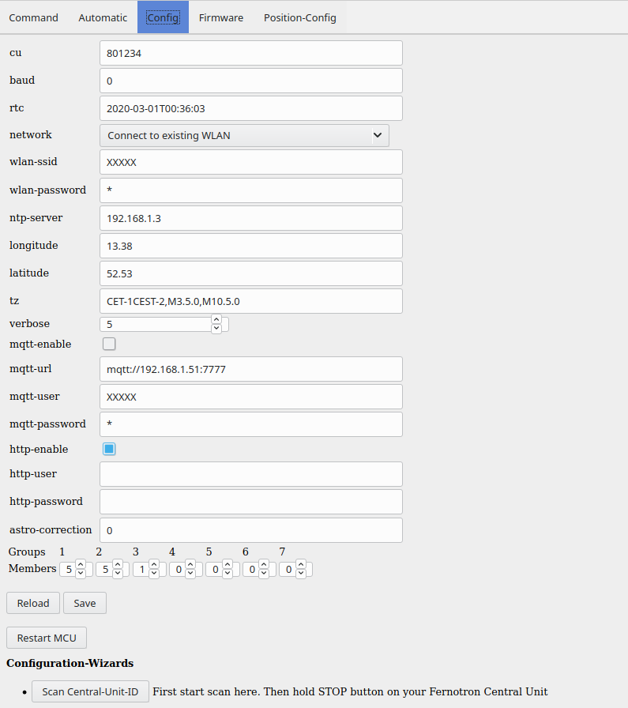

##### Configuration using built-in [web-server](webserver.md)



* First read about [network](network.md) to learn how to access the built-in webserver

* Options:
     * cu: ID of Central Unit. You may use the ID of your existing Central Unit. For the Fernotron 2411 the ID can be found inside the battery compartment.
     * rtc: Internal real time clock. Its set automatically by the built-in NTP client.
     * network: choose between WLAN-AccessPoint, WLAN-Station, Ethernet/LAN (restart required)
     * wlan-ssid, wlan-password: if network=WLAN-Station, then use these to login to your WLAN-Router/AP (restart required)
     * ntp-server: examples: 1) pool.ntp.orgm,  2) IP4 address of your Router/Gateway if it provides NTP
     * longitude, latitude: geographical coordinates used to calculate the local time of civil-dusk
     * tz: Posix style time-zone
     * verbose: debug output level (on serial interface and TCP only)
     * mqtt-enable: enable built-in MQTT client
     * mqtt-url: mqtt server address in the form of a URL
     * mqtt-user, mqtt-password: credentials for the MQTT server
     * mqtt-client-id: There cannot be more than one identical client-ID logged into a server. (default: tfmcu)
     * mqtt-root-topic: All topics will be prefixed by this (default: tfmcu)
     * http-enable: enable built-in HTTP webserver
     * http-user, http-password: optional. if set the webserver requires authentication to be accessed
     * astro-correction: workaround for fernotron astro table problem: 0: use average civil dusk time, 1: never too late, 2: never too early
     * rf-tx-pin: RF output GPIO pin
     * rf-rx-pin: RF input GPIO pin
     * set-button-pin: Set-button input GPIO pin
     * gpioN: Pins for input/output (can then be read/set via CLI and MQTT)
     * Group/Members: define how many members are used in each group. Unused groups and members may then be hidden in the user interface
 * Buttons:
      * Reload: read in all config options again from the MCU
      * Save: store modified config options to the MCU
      * Restart MCU: reboot the MCU, which is required for some options to take effect
 * Configuration Wizwards:
       * Scan Central-Unit-ID: scan the ID of your original Central Unit (RF receiver required). If you cannot find the ID-Label inside your Central Units battery compartment.
     
     
<hr>


##### Configuration using [command-line-interface](CLI.md) on serial terminal or TCP port 7777 terminal

```
'config' sets or gets options. Use: config option=value ...; to set. Use: config option=? ...; to get, if supported

cu=(ID|auto|?)     6-digit hex ID of Central-Unit. auto: capture ID
rtc=(ISO_TIME|?)   set local time if NTP not working
wlan-ssid=(SSID|?)
wlan-password=PW
network=(wlan|ap|lan) ap opens wlan access-point at 192.168.4.1 (restart required)
ntp-server=(gateway|dhcp|IP4ADDR|NAME) default: gateway
mqtt-enable=(0|1)  enable MQTT
mqtt-url=URL       broker/server URL (e.g. mqtt://192.168.1.42:7777)
mqtt-user=NAME     user name on server
mqtt-password=PW   user password on server
mqtt-client-id=ID  default: tfmcu
mqtt-root-topic=TOPIC default: tfmcu
http-enable=(0|1)  enable HTTP
http-user=NAME     user name on server
http-password=PW   user password on server
longitude=(DEG|?)
latitude=(DEG|?)
tz=(POSIX_TZ|?)    time zone for RTC/NTP
astro-correction   modifies astro table: 0=average, 1=bright 2=dark
verbose=(0..5|?)   diagnose output verbosity level
set-pw=password    set a config password. if set every config commands needs the pw option
pw=PW              example: config pw=my_passw dst=eu;
restart            restart MCU
gpioN=(d|i|o|O|q|Q|?)(h|l|m) Set gpio as pin for input (i) output (O), open drain output (o) or input/output (q,Q).
                   Add suffix to input to enable pull up (h), pull down (l), pull up/down (m)
                   Add suffix (h|l) to output to set the initial level high or low at restart
                   Disable gpio (d)
                   Example: config gpio19=ol gpio18=ih gpio20=qh gpio21=d;
rf-tx-pin=N        RF output GPIO pin
rf-rx-pin=N        RF input GPIO pin
set-button-pin     Set-button input GPIO pin
```

<hr>

##### Configuration using FHEM homeserver module from [tronferno-fhem](https://github.com/zwiebert/tronferno-fhem)

<hr>

##### Configuration using tfmenutool.py from [tronferno-mcu-bin](https://github.com/zwiebert/tronferno-mcu-bin)

<hr>

##### Configuration using Tronferno Android App from [tronferno-andro](https://github.com/zwiebert/tronferno-andro)


